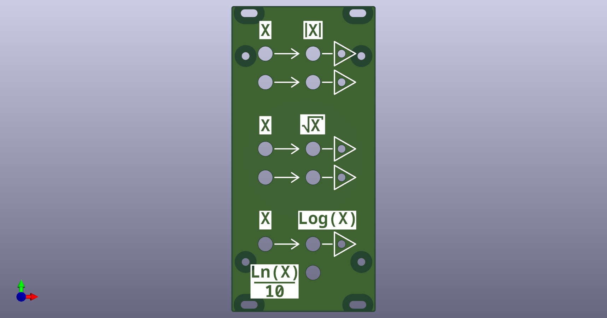
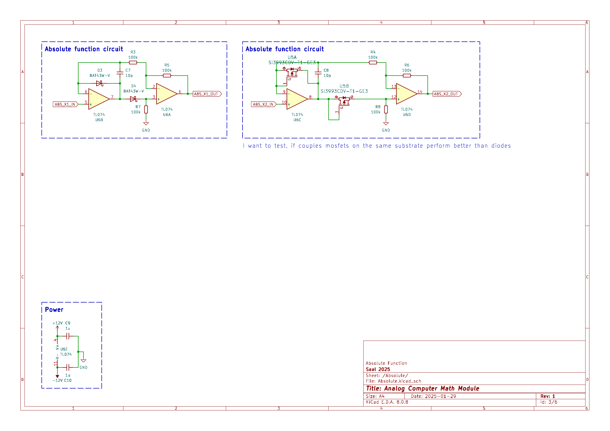
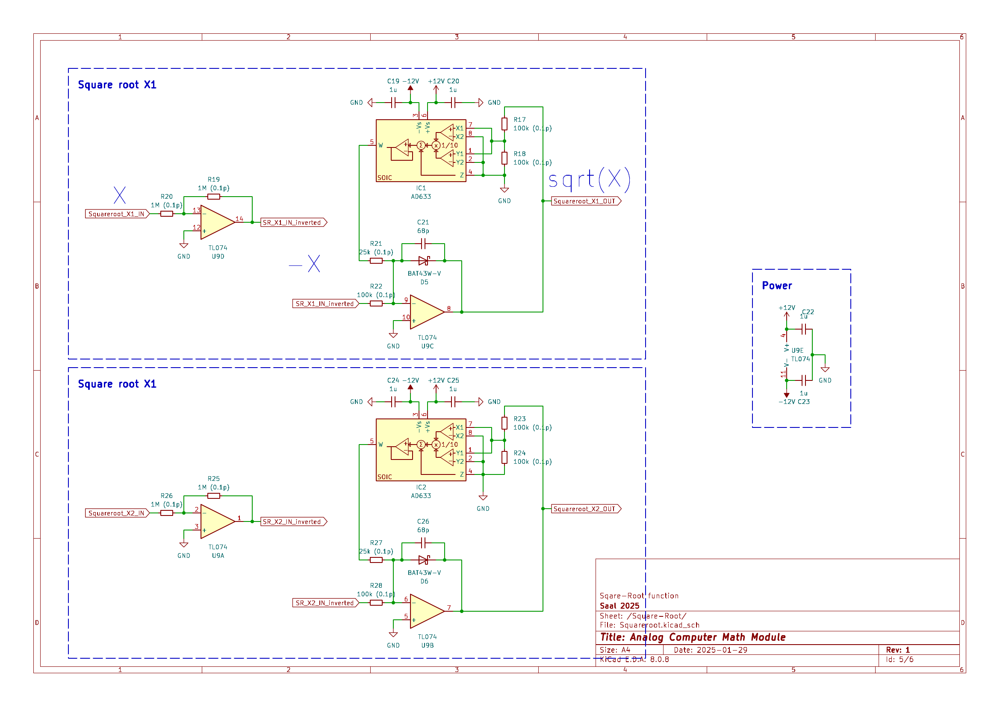
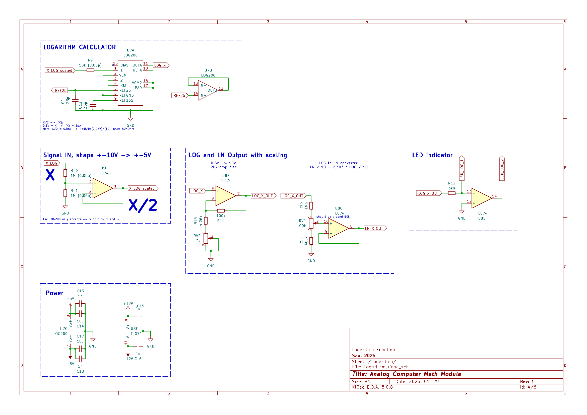

# Analog Computer: Math Extension Module

This repository provides a math extension module for analog computing applications. The module provides two absolute value functions, two square-root functions, and one logarithmic value function (base $10$ and $e$) of the input. Each output features an indicator LED that provides visual feedback proportional to the output value.

## Module Schematic

**<ins>Absolute function(x):</ins>** $x \rightarrow |x|$

The circuit for the absolute value function incorporates two different designs.

The left circuit is based on individual diodes and represents the classical implementation of an absolute value circuit. This circuit follows the design outlined in the document [PRECISION ABSOLUTE VALUE CIRCUITS](https://www.ti.com/lit/pdf/sboa068) from BURR-BROWN/TI.

The right circuit is similar but with one important difference: the diodes are replaced with P-channel MOSFETs on a single substrate. This should ensure thermal coupling and closely specifications of the two MOSFETs.

**<ins>Square-Root function(x):</ins>** $x \rightarrow \sqrt{x}$

The circuit implementation of the square-root function is based on the feedback principle. A multiplier squares the output signal and feeds it back into an open-loop amplifier to yield the inverse function. The diode in the feedback path ensures that only negative values are allowed at the input; otherwise, the output remains close to zero, preventing overload. For ease of use, an inverter is placed before the input, resulting in the overall transfer function of the module:

$$
\begin{align}
  f(x) = \begin{cases}
  \sqrt{x} & \text{if } x > 0 \\
  0 & \text{if } x \le 0
  \end{cases}
\end{align}
$$

This circuit design is based on the schematic and principals presented in the book [Analog and Hybrid Computer Programming](https://www.degruyter.com/document/doi/10.1515/9783110662207/html) by Prof. Dr. Bernd Ulmann and the [book on the THAT Analog Computer](http://www.astro-electronic.de/THAT_Analog_Computer_Book.pdf) by Michael Koch.

**<ins>Logarithmic function(x):</ins>** $x \rightarrow \mathrm{log}_{10}(x)$ and $x \rightarrow \mathrm{log}_{e}(x)$

The logarithm function circuit is based on the [LOG200](https://www.ti.com/product/LOG200) chip from Texas Instruments. The input voltage must be scaled down from $\pm 10 \, V$ to the chip's maximum accepted range of $\pm 5 \, V$. According to the datasheet, $-5V$ falls within the absolute maximum ratings and will not damage the chip.

The transfer function of the LOG200 chip is

$$ V_\mathrm{LOG} = 250 \, mV \cdot \mathrm{log}_{10} \left( \frac{I_1}{I_2} \right) $$

which depends on the ratio of the input currents $I_1$ and $I_2$. The input current $I_2$ is wired to the internal $1 \, \mu A$ precision current source. Accordingly, the input voltage has to be scaled using a precision (0.05\%) $50k\Omega$ resistor to give the appropriate current $I_1$. Since we want to map the output to the full range of our machine unit, $\pm1$ or $\pm 10 \,V$, a "20x" amplifier is placed after the output of the Voltage $V_\mathrm{LOG}$.

With this scaling, the following input-output relationship is achieved:

| Input      | Current $I_1$ | Output of LOG200 | Circuit Output |
|------------|---------------|------------------|----------------|
|$0.001 \, V$|$0.01 \, \mu A$|$-0.5\,V$         | $-10 \, V$     |
|$0.01 \, V$ |$0.1 \, \mu A$ |$-0.25\,V$        | $-5 \, V$      |
|$0.1 \, V$  |$1 \, \mu A$   |$0\,V$            | $0 \, V$       |
|$1 \, V$    |$10 \, \mu A$  |$0.25\,V$         | $5 \, V$       |
|$10 \, V$   |$100 \, \mu A$ |$0.5\,V$          | $10 \, V$      |

To additionally compute the natural logarithm $\mathrm{log}_e$, we use the relation:

$$ \mathrm{log}_{e}(x) = \frac{\mathrm{log}_{10}(x)}{\mathrm{log}_{10}(e)} = 2.303 \cdot \mathrm{log}_{10}(x) $$

A simple scaling amplifier with a gain of $0.2303x$ is used to provide the output of $\mathrm{log}_e(x) / 10$.

This circuit design and Input/Output scaling are based on the circuit presented in the book [Analog and Hybrid Computer Programming](https://www.degruyter.com/document/doi/10.1515/9783110662207/html) by Prof. Dr. Bernd Ulmann. I took the liberty of replacing the LOG112 with the LOG200 chip and adding the natural logarithm functionality.

## BOM

**<ins>Main Module:</ins>** 

|Reference                                   |Value              |Footprint                          |QUANTITY|
|--------------------------------------------|-------------------|-----------------------------------|--------|
|C1,C2,C14,C17                               |10u                |1206 / 3216Metric                  |4       |
|C3,C5                                       |0.33u              |1206 / 3216Metric                  |2       |
|C4,C6,C9,C10,C15,C16,C19,C20,C22-C25,C27,C28|1u                 |1206 / 3216Metric                  |14      |
|C7,C8                                       |10p                |1206 / 3216Metric                  |2       |
|C11,C12                                     |33p                |1206 / 3216Metric                  |2       |
|C13,C18                                     |1n                 |1206 / 3216Metric                  |2       |
|C21,C26                                     |68p                |1206 / 3216Metric                  |2       |
|D1                                          |12V_GREEN          |1206 / 3216Metric                  |1       |
|D2                                          |-12V_RED           |1206 / 3216Metric                  |1       |
|D3-D6                                       |BAT43W-V           |1206 / 3216Metric                  |4       |
|IC1,IC2                                     |AD633              |SOIC-8                             |2       |
|J1                                          |Conn_01x23_Pin     |PinHeader_1x23_P2.54mm_Vertical    |1       |
|J2                                          |Conn_02x05_Odd_Even|PinHeader_2x05_P2.54mm_Vertical    |1       |
|Q1                                          |PMV250EPEA         |SOT-23                             |1       |
|Q2                                          |PMV450ENEA         |SOT-23                             |1       |
|R1                                          |11k2               |1206 / 3216Metric                  |1       |
|R2                                          |5k6                |1206 / 3216Metric                  |1       |
|R3-R8,R14                                   |100k               |1206 / 3216Metric                  |7       |
|R9                                          |50k (0.05p)        |1206 / 3216Metric                  |1       |
|R10,R11                                     |1M (0.05p)         |1206 / 3216Metric                  |2       |
|R12,R29-R32                                 |3k9                |1206 / 3216Metric                  |5       |
|R13                                         |1M5                |1206 / 3216Metric                  |1       |
|R15                                         |4.26k              |1206 / 3216Metric                  |1       |
|R16                                         |400k               |1206 / 3216Metric                  |1       |
|R17,R18,R22-R24,R28                         |100k (0.1p)        |1206 / 3216Metric                  |6       |
|R19,R20,R25,R26                             |1M (0.1p)          |1206 / 3216Metric                  |4       |
|R21,R27                                     |25k (0.1p)         |1206 / 3216Metric                  |2       |
|RV1                                         |100k               |Potentiometer_Bourns_3296W_Vertical|1       |
|RV2                                         |2k                 |Potentiometer_Bourns_3296W_Vertical|1       |
|U1                                          |MC7805ACTG         |TO-220-3_Vertical                  |1       |
|U2                                          |MC7905BTG          |TO-220-3_Vertical                  |1       |
|U3,U4                                       |VCAN16A2           |VCAN16A2-03S-E3-08                 |2       |
|U5                                          |SI3993CDV-T1-GE3   |TSOT-23-6                          |1       |
|U6,U8-U10                                   |TLE2074IDWR        |SOIC-14\_3.9x8.7mm\_P1.27mm        |4       |
|U7                                          |LOG200             |VQFN-16                            |1       |

**<ins>Middleplate:</ins>**

|Reference                                   |Value              |Footprint                          |QUANTITY|
|--------------------------------------------|-------------------|-----------------------------------|--------|
|D1-D5                                       |BI color LED       |LED_D3.0mm_FlatTop                 |5       |
|J1                                          |Conn_01x23_Pin     |PinSocket_1x23_P2.54mm_Vertical    |1       |
|U1-U6                                       |VCAN16A2           |VCAN16A2-03S-E3-08                 |6       |

## List of special Components:

- OP-amp: [TLE2074IDWR](https://www.digikey.de/en/products/detail/texas-instruments/TLE2074IDWR/2799317) (Upgrade of the [TL074HIDR](https://www.digikey.de/en/products/detail/texas-instruments/TL074HIDR/13563033))
- logarithmic amplifier: [TL441CN](https://www.digikey.de/de/products/detail/texas-instruments/TL441CN/1675117), [LOG112AID](https://www.digikey.de/de/products/detail/texas-instruments/LOG112AID/486371), [LOG200RGTT](https://www.digikey.de/de/products/detail/texas-instruments/LOG200RGTT/25821029), [LOG200-datasheet](https://www.ti.com/product/LOG200)
- Multiplier: [AD633JRZ](https://www.digikey.de/en/products/detail/analog-devices-inc/AD633JRZ/617831) to [AD835ARZ](https://www.digikey.de/en/products/detail/analog-devices-inc/AD835ARZ-REEL7/621103)
- P-MOSFET: [SSFQ3805](https://www.digikey.de/en/products/detail/good-ark-semiconductor/SSFQ3805/18667583), [SI3993CDV-T1-GE3](https://www.digikey.de/en/products/detail/vishay-siliconix/SI3993CDV-T1-GE3/4876436)
- P-MOSFET (matched pair):[ALD1117SAL](https://www.digikey.de/en/products/detail/advanced-linear-devices-inc/ALD1117SAL/2414325)
- 16-BIT Schottky Barrier Diode Bus-Termination Array: [SN74S1053PWR](https://www.digikey.de/en/products/detail/texas-instruments/SN74S1053PWR/509741)
- 2 PNP (Dual) Matched Pair:[site](https://www.diodes.com/products/discrete-semiconductors/bipolar-transistors/transistor-bjt-master-table/matchedpair/#), [DMMT3906W-7-F](https://www.digikey.de/en/products/detail/diodes-incorporated/DMMT3906W-7-F/717760), [BCM847BS](https://www.digikey.de/en/products/detail/diotec-semiconductor/BCM847BS/22600802)
- +5V Regulator: [MC7805ACTG](https://www.digikey.de/en/products/detail/onsemi/MC7805ACTG/1481210), [MC7805ABTG](https://www.digikey.de/en/products/detail/onsemi/MC7805ABTG/921035)
- -5V Regulator: [MC7905BTG](https://www.digikey.de/en/products/detail/onsemi/MC7905BTG/1481513)

## License

This work is published under the [CERN Open Hardware Licence Version 2 - Strongly Reciprocal](LICENSE)

